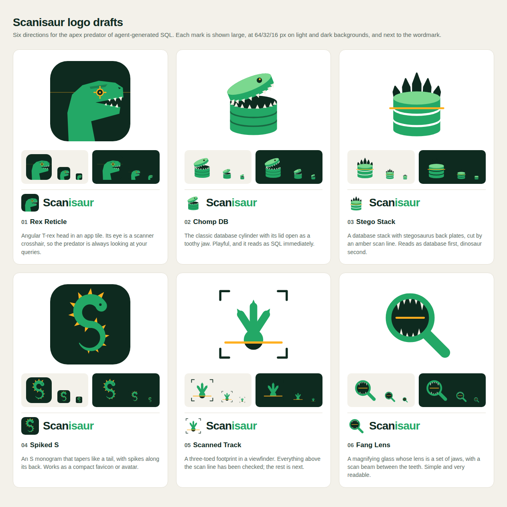

# Logo drafts

Six first-pass directions for the Scanisaur mark. Each one is a standalone
512×512 SVG with no external fonts or images.

Open `preview.html` in a browser to see the same sheet live.

| # | File | Idea |
|---|------|------|
| 01 | [`01-rex-reticle.svg`](01-rex-reticle.svg) | Angular T-rex head in an app tile; the eye is a scanner crosshair. |
| 02 | [`02-chomp-db.svg`](02-chomp-db.svg) | Database cylinder whose lid opens as a toothy jaw. |
| 03 | [`03-stego-stack.svg`](03-stego-stack.svg) | Database stack with stegosaurus back plates and an amber scan line. |
| 04 | [`04-spiked-s.svg`](04-spiked-s.svg) | "S" monogram that tapers like a tail, with spikes along its back. |
| 05 | [`05-scanned-track.svg`](05-scanned-track.svg) | Three-toed footprint in a viewfinder, half scanned. |
| 06 | [`06-fang-lens.svg`](06-fang-lens.svg) | Magnifying glass whose lens is a set of jaws, with a scan beam. |

## Palette

| Role | Hex |
|------|-----|
| Deep jungle (dark) | `#0E2A1F` |
| Scanisaur green | `#23A866` |
| Light green | `#7BD88F` |
| Scan amber (accent) | `#FFB020` |
| Bone (teeth) | `#F4EFE3` |

## Notes for picking one

- **Smallest sizes:** 01, 04 and 06 still read at 16 px. 02, 03 and 05 lose
  detail below about 32 px and would need a simplified favicon version.
- **Dark backgrounds:** 03's plates and 05's viewfinder corners and heel are
  drawn in the deep green, so they disappear on dark backgrounds. Both need a
  light variant before they can be used there.
- **Wordmark:** the preview sets "Scanisaur" in a system sans-serif as a
  placeholder. A final lockup should use a chosen typeface converted to
  outlines.
